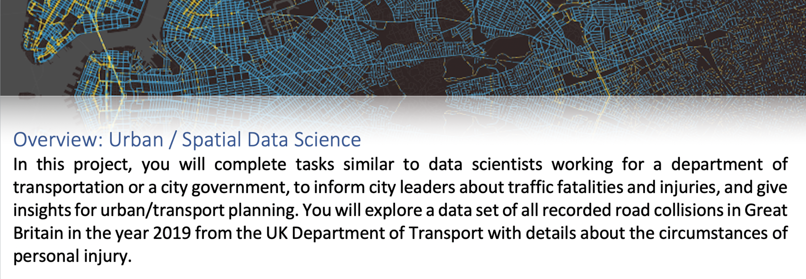

# INSTRUCTOR's VERSION: First Year Project 2021 @ ITU
## Project 1, Road collisions analysis

This Github repository contains the instructor's teaching material for the [course](https://learnit.itu.dk/course/view.php?id=3019694) project, lasting for 4-5 lectures. This is a data analysis project for first year data science students, after they have learned programming basics. It teaches the students:

-	Exploring and transforming real raw data, making numerical and visual reports
-	Connecting data tables (accidents, vehicles, casualties)
-	Investigating possible statistical associations by filtering for a variety of attributes
-	Visualizing the data on a map

The instructor should keep this repo hidden from students, because updates are supposed to be pushed as the lecture progresses for the student repo, see here: https://github.com/mszell/fyp2021p01lectures

Course page: https://learnit.itu.dk/course/view.php?id=3019694

